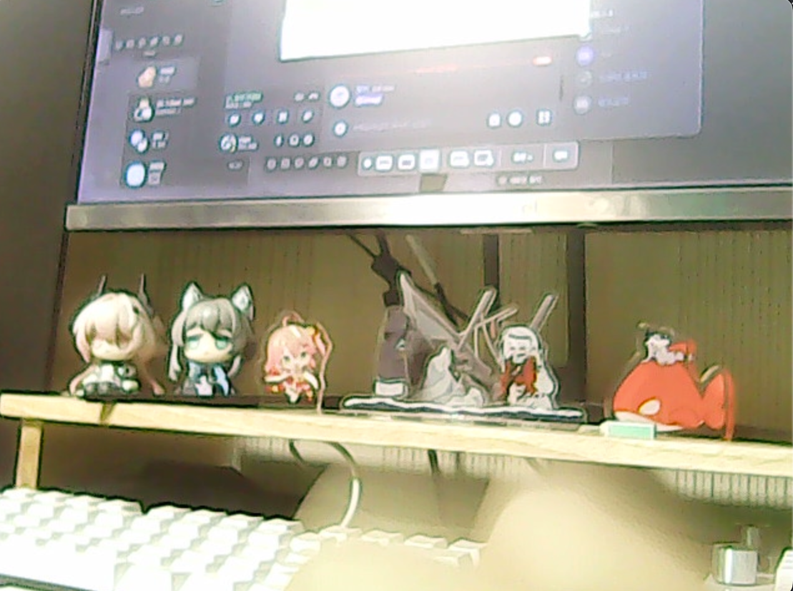

# imgcartoon
Simple OpenCV program that transforms images into cartoon style using edge detection and color filtering.

## Example Result

This program applies bilateral filtering and adaptive thresholding to create a cartoon effect from standard images.
